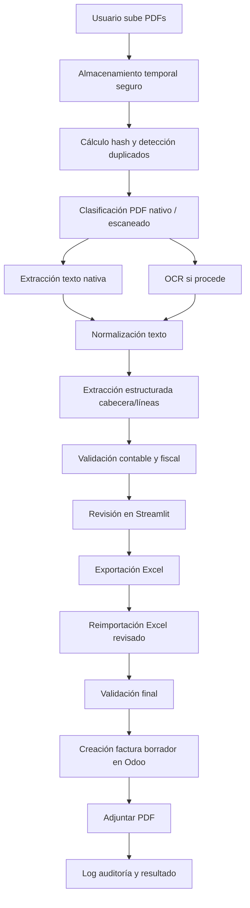

# Especificación funcional y técnica — Aplicación Streamlit para lectura de facturas PDF y registro de facturas de proveedor en Odoo 18 Enterprise

**Fecha:** 2026-06-04  
**Destino del documento:** IA/codificador encargado de construir, probar y dejar operativa la aplicación.  
**Rol asumido:** Analista funcional y técnico senior.  
**Stack objetivo:** Python + Streamlit + OCR local + validación estructurada + Excel revisable + integración con Odoo 18 Enterprise mediante API externa.

---

## 1. Objetivo del proyecto

Desarrollar una aplicación en **Streamlit** que permita:

1. Subir uno o varios archivos PDF que contienen facturas de gastos o compras.
2. Detectar si cada PDF contiene texto embebido o si es una factura escaneada.
3. Extraer texto mediante lectura nativa o mediante OCR.
4. Interpretar el contenido de la factura y convertirlo en datos estructurados.
5. Generar una tabla Excel revisable con:
   - Cabecera de factura.
   - Líneas de factura.
   - Proveedor.
   - Bases imponibles.
   - Impuestos.
   - Cuentas contables.
   - Posición fiscal si procede.
   - Distribución analítica si procede.
   - Estado de validación.
   - Errores o advertencias.
6. Permitir la revisión/corrección de datos desde Streamlit y/o desde Excel.
7. Registrar en Odoo 18 Enterprise las facturas de proveedor como **borradores**, adjuntando el PDF original y dejando trazabilidad de todo el proceso.
8. Evitar duplicados, controlar errores, aplicar reintentos cuando proceda y dejar un log/auditoría completa.

El objetivo principal no es solo leer PDFs, sino **crear facturas de proveedor fiables en Odoo**, con detalle de líneas, cuentas, impuestos y evidencias, minimizando errores contables.

---

## 2. Principios de diseño

### 2.1. Principio de seguridad contable

La aplicación **no debe contabilizar automáticamente** facturas en Odoo salvo que el usuario active expresamente esa opción y todas las validaciones críticas estén en verde.

Por defecto:

- Se crearán facturas de proveedor en estado **borrador**.
- Se adjuntará el PDF original.
- Se guardará una referencia interna de importación.
- Se permitirá revisar en Odoo antes de confirmar.

### 2.2. Principio de revisión humana

La extracción OCR/IA puede fallar. Por tanto:

- Cada campo extraído tendrá, cuando sea posible, un indicador de confianza.
- Los campos críticos se validarán contra totales e información maestra de Odoo.
- La aplicación debe facilitar la revisión antes del envío a Odoo.
- Ninguna factura con errores críticos debe importarse.

### 2.3. Principio de idempotencia

La aplicación debe poder reintentarse sin duplicar facturas.

Debe usarse una estrategia combinada:

- Hash SHA-256 del PDF.
- NIF/VAT del proveedor.
- Número de factura del proveedor.
- Fecha de factura.
- Importe total.
- Registro local de importaciones.
- Búsqueda previa en Odoo por `move_type`, `partner_id`, `ref`, `invoice_date`, `amount_total` y `company_id`.

Si es posible añadir un campo personalizado en Odoo, se recomienda `x_import_uuid` o `x_source_file_hash` en `account.move`. Si no se puede personalizar Odoo, mantener una tabla SQLite local de trazabilidad.

### 2.4. Principio de configuración explícita

No se deben inventar cuentas contables.

La aplicación debe permitir configurar reglas de asignación:

- Por proveedor.
- Por NIF/VAT.
- Por palabra clave.
- Por producto.
- Por familia de gasto.
- Por porcentaje de IVA.
- Por diario.
- Por empresa.
- Por cuenta analítica.

Si no existe regla suficiente, la factura debe quedar en estado `REQUIERE_REVISION`.

---

## 3. Información técnica contrastada que condiciona el diseño

### 3.1. Odoo 18 Enterprise

Odoo 18 permite integración externa mediante API externa XML-RPC. Para Odoo Online, los usuarios no tienen contraseña local por defecto, por lo que para XML-RPC es necesario configurar contraseña o usar API key según el caso. Las API keys se usan sustituyendo la contraseña en las llamadas y deben tratarse con la misma protección que una contraseña.

La API externa usa el endpoint `xmlrpc/2/common` para autenticar con `authenticate` y `xmlrpc/2/object` para llamar métodos de modelos mediante `execute_kw`.

La creación de registros se realiza con `create`, que recibe un mapa de campos y devuelve el identificador del registro creado. La consulta puede realizarse con `search`, `read` o `search_read`.

Odoo 18 Enterprise también dispone de digitalización de documentos mediante OCR e IA para facturas de proveedor, con campos reconocidos como proveedor, referencia, fecha de factura, vencimiento, moneda, descripción de líneas, cantidad, precio unitario, impuestos, base e importe total. No obstante, es un servicio IAP que consume créditos y no sustituye la necesidad de validaciones personalizadas, reglas contables propias ni control local del proceso.

### 3.2. Streamlit

Streamlit permite construir una interfaz web rápida. Se utilizarán:

- `st.file_uploader` para subir múltiples PDFs.
- `st.session_state` para mantener estado entre reruns.
- `st.data_editor` para edición tabular revisable.
- `st.download_button` para descargar Excel, logs y resultados.

### 3.3. Extracción PDF y OCR

Se recomienda un pipeline híbrido:

1. Intentar extracción nativa de texto con PyMuPDF/pdfplumber.
2. Si el texto es insuficiente o el PDF es escaneado, ejecutar OCR.
3. Para OCR local:
   - Tesseract instalado como binario del sistema.
   - `pytesseract` como wrapper Python.
   - Preprocesado de imagen con OpenCV/Pillow.
   - Conversión/renderizado de páginas con PyMuPDF o pdf2image.

PyMuPDF dispone de soporte OCR basado en Tesseract, pero Tesseract debe estar instalado aparte. `pdfplumber` es útil para texto/tablas en PDFs nativos, pero no proporciona OCR.

### 3.4. Excel

La salida Excel debe generarse con `pandas` y `openpyxl`. `pandas.DataFrame.to_excel` permite escribir dataframes en `.xlsx`; `openpyxl` permite estilos, validaciones, anchos de columna, colores y hojas adicionales.

---

## 4. Alcance propuesto

## 4.1. MVP obligatorio

La primera versión debe incluir:

1. Subida múltiple de PDFs.
2. Identificación de PDF nativo frente a PDF escaneado.
3. OCR en español.
4. Extracción estructurada de cabecera y líneas.
5. Vista de revisión en Streamlit.
6. Exportación a Excel.
7. Lectura de Excel revisado.
8. Validación de proveedores, impuestos, cuentas y totales.
9. Conexión con Odoo 18.
10. Creación de facturas de proveedor en borrador.
11. Adjuntar PDF original a la factura.
12. Registro local de auditoría.
13. Control de duplicados.
14. Reintentos ante errores transitorios.
15. Informe de errores por factura.

## 4.2. Funcionalidades fase 2

1. Aprendizaje de reglas por proveedor.
2. Sugerencia automática de cuenta contable según historial de Odoo.
3. Sugerencia automática de impuesto según proveedor/producto/cuenta.
4. Validación de NIF/VAT.
5. Soporte para XML embebido o adjunto si el PDF procede de factura electrónica.
6. División de PDFs con varias facturas.
7. Detección de facturas rectificativas/abonos.
8. Conciliación con pedidos de compra.
9. Lectura desde buzón de correo.
10. Modo lote con cola de procesamiento.
11. Panel de métricas de calidad OCR.
12. Integración opcional con el servicio nativo de digitalización de Odoo.

---

## 5. Arquitectura funcional



Si el entorno no permite renderizar Mermaid en la documentación, conservar el diagrama como texto orientativo.

---

## 6. Arquitectura técnica propuesta

Estructura recomendada del proyecto:

```text
invoice_ocr_odoo_app/
├── app.py
├── pages/
│   ├── 01_configuracion.py
│   ├── 02_procesar_pdfs.py
│   ├── 03_revision.py
│   ├── 04_exportar_excel.py
│   ├── 05_importar_odoo.py
│   └── 06_auditoria.py
├── core/
│   ├── config.py
│   ├── constants.py
│   ├── exceptions.py
│   ├── logging_config.py
│   └── security.py
├── schemas/
│   ├── invoice_schema.py
│   ├── odoo_schema.py
│   ├── validation_schema.py
│   └── excel_schema.py
├── services/
│   ├── pdf_classifier.py
│   ├── pdf_text_extractor.py
│   ├── ocr_engine.py
│   ├── image_preprocessor.py
│   ├── invoice_extractor.py
│   ├── llm_extractor.py
│   ├── rule_extractor.py
│   ├── normalizer.py
│   ├── validator.py
│   ├── tax_mapper.py
│   ├── account_mapper.py
│   ├── partner_matcher.py
│   ├── excel_exporter.py
│   ├── excel_importer.py
│   ├── odoo_client.py
│   ├── odoo_importer.py
│   └── attachment_service.py
├── repositories/
│   ├── audit_repository.py
│   ├── import_repository.py
│   ├── master_data_repository.py
│   └── sqlite.py
├── data/
│   ├── uploads/
│   ├── processed/
│   ├── exports/
│   ├── logs/
│   └── sqlite/
├── tests/
│   ├── unit/
│   ├── integration/
│   ├── fixtures/
│   └── e2e/
├── scripts/
│   ├── check_tesseract.py
│   ├── sync_odoo_masters.py
│   ├── create_custom_fields_odoo.py
│   └── smoke_test_odoo.py
├── .streamlit/
│   ├── config.toml
│   └── secrets.toml.example
├── requirements.txt
├── pyproject.toml
├── README.md
└── .env.example
```

---

## 7. Configuración de entorno

### 7.1. Dependencias Python recomendadas

```text
streamlit
pandas
openpyxl
pydantic
python-dotenv
requests
tenacity
PyMuPDF
pdfplumber
pytesseract
Pillow
opencv-python
rapidfuzz
python-dateutil
numpy
pytest
pytest-mock
responses
```

Opcionales:

```text
pdf2image
camelot-py
tabula-py
sqlalchemy
orjson
unidecode
jsonschema
```

Si se usa un LLM:

```text
openai
instructor
ollama
```

La elección del LLM debe ser configurable. Para datos sensibles, priorizar ejecución local o anonimización previa.

### 7.2. Dependencias del sistema

En Linux/Docker:

```bash
apt-get update
apt-get install -y \
  tesseract-ocr \
  tesseract-ocr-spa \
  tesseract-ocr-eng \
  poppler-utils \
  libgl1 \
  libglib2.0-0
```

En Windows:

- Instalar Tesseract OCR.
- Añadir ruta de `tesseract.exe` a variables de entorno.
- Configurar en la app la ruta si no está en PATH.

### 7.3. Configuración Streamlit

`.streamlit/config.toml`:

```toml
[server]
maxUploadSize = 200

[browser]
gatherUsageStats = false
```

`.streamlit/secrets.toml.example`:

```toml
[odoo]
url = "https://miempresa.odoo.com"
db = "miempresa"
username = "usuario@empresa.com"
api_key = "CAMBIAR"

[app]
environment = "dev"
default_company_id = 1
default_purchase_journal_id = 1
allow_auto_post = false
```

No subir nunca `secrets.toml` real al repositorio.

---

## 8. Modelo de datos interno

### 8.1. Factura extraída

Usar Pydantic.

```python
class ExtractedInvoice(BaseModel):
    import_uuid: str
    source_file_name: str
    source_file_hash: str
    document_type: Literal["vendor_bill", "vendor_refund", "unknown"]

    supplier_name: str | None
    supplier_vat: str | None
    supplier_address: str | None
    supplier_iban: str | None

    invoice_number: str | None
    invoice_date: date | None
    due_date: date | None

    currency: str = "EUR"
    untaxed_amount: Decimal | None
    tax_amount: Decimal | None
    total_amount: Decimal | None

    lines: list[ExtractedInvoiceLine]

    raw_text: str
    extraction_confidence: float
    validation_status: Literal["OK", "WARNING", "ERROR", "REQUIRES_REVIEW"]
    validation_messages: list[ValidationMessage]
```

### 8.2. Línea de factura

```python
class ExtractedInvoiceLine(BaseModel):
    line_uuid: str
    description: str
    quantity: Decimal = Decimal("1")
    unit_price: Decimal | None
    discount: Decimal = Decimal("0")
    subtotal: Decimal | None
    tax_rate: Decimal | None

    suggested_product_id: int | None
    suggested_account_id: int | None
    suggested_tax_ids: list[int]
    analytic_distribution: dict[str, float] | None

    confidence: float
    validation_status: Literal["OK", "WARNING", "ERROR", "REQUIRES_REVIEW"]
    validation_messages: list[ValidationMessage]
```

### 8.3. Resultado de importación a Odoo

```python
class OdooImportResult(BaseModel):
    import_uuid: str
    source_file_hash: str
    status: Literal["CREATED", "SKIPPED_DUPLICATE", "ERROR", "POSTED"]
    odoo_move_id: int | None
    odoo_move_name: str | None
    odoo_display_url: str | None
    error_type: str | None
    error_message: str | None
    attempts: int
```

---

## 9. Hojas del Excel generado

El Excel debe ser un documento de trabajo y auditoría, no una simple tabla.

### 9.1. Hoja `01_FACTURAS`

Una fila por factura.

Columnas:

| Columna | Descripción | Obligatoria |
|---|---|---|
| `import_uuid` | Identificador interno | Sí |
| `source_file_name` | Nombre PDF | Sí |
| `source_file_hash` | SHA-256 | Sí |
| `document_type` | vendor_bill/vendor_refund | Sí |
| `supplier_name` | Nombre proveedor | Sí |
| `supplier_vat` | NIF/VAT proveedor | Recomendado |
| `odoo_partner_id` | ID proveedor en Odoo | Sí antes de importar |
| `invoice_number` | Número factura proveedor | Sí |
| `invoice_date` | Fecha factura | Sí |
| `due_date` | Vencimiento | No |
| `currency` | Moneda | Sí |
| `journal_id` | Diario de compras | Sí |
| `fiscal_position_id` | Posición fiscal | No |
| `untaxed_amount` | Base imponible total | Sí |
| `tax_amount` | Cuota total | Sí |
| `total_amount` | Total factura | Sí |
| `validation_status` | OK/WARNING/ERROR | Sí |
| `selected_for_import` | TRUE/FALSE | Sí |
| `odoo_move_id` | Resultado importación | No |
| `odoo_status` | CREATED/ERROR/etc. | No |
| `notes` | Observaciones | No |

### 9.2. Hoja `02_LINEAS`

Una fila por línea de factura.

Columnas:

| Columna | Descripción |
|---|---|
| `import_uuid` | Relación con factura |
| `line_uuid` | Identificador línea |
| `description` | Descripción |
| `quantity` | Cantidad |
| `unit_price` | Precio unitario |
| `discount` | Descuento |
| `subtotal` | Base de línea |
| `tax_rate` | Porcentaje IVA/retención detectado |
| `odoo_product_id` | Producto Odoo opcional |
| `odoo_account_id` | Cuenta contable |
| `odoo_tax_ids` | Lista de IDs separados por coma |
| `analytic_distribution` | JSON para distribución analítica |
| `validation_status` | Estado |
| `validation_messages` | Mensajes |

### 9.3. Hoja `03_ERRORES`

Registro de errores y advertencias.

Columnas:

- `import_uuid`
- `source_file_name`
- `level`
- `field`
- `message`
- `suggested_action`

### 9.4. Hoja `04_MAESTROS_ODOO`

Datos descargados de Odoo para facilitar revisión:

- Proveedores.
- Cuentas contables de gasto.
- Impuestos de compra activos.
- Diarios de compra.
- Monedas.
- Productos.
- Cuentas analíticas.
- Posiciones fiscales.

### 9.5. Hoja `05_AUDITORIA`

Trazabilidad:

- Usuario.
- Fecha de procesamiento.
- Hash archivo.
- Motor OCR.
- Idioma OCR.
- Tiempo de proceso.
- Confianza media.
- Intentos de importación.
- Resultado.

### 9.6. Estilos Excel

Aplicar:

- Cabecera en negrita.
- Filtros.
- Freeze panes.
- Ajuste de ancho de columnas.
- Validaciones de datos para campos como `selected_for_import`, `document_type`, `validation_status`.
- Colores:
  - Verde: OK.
  - Amarillo: WARNING.
  - Rojo: ERROR.
- Hoja protegida opcionalmente para columnas técnicas, dejando editables las columnas de revisión.

---

## 10. Interfaz Streamlit

### 10.1. Página 1 — Configuración

Debe permitir:

- Probar conexión con Odoo.
- Sincronizar maestros.
- Ver empresa activa.
- Ver diario de compras por defecto.
- Ver impuestos activos.
- Ver cuentas de gasto.
- Ver proveedores.
- Configurar:
  - Modo OCR.
  - Idiomas OCR.
  - Umbral mínimo de confianza.
  - Directorio de trabajo.
  - Permitir o no crear proveedores.
  - Permitir o no contabilizar automáticamente.
  - Política de duplicados.

### 10.2. Página 2 — Procesar PDFs

Debe permitir:

- Subir múltiples PDFs.
- Mostrar tabla de archivos:
  - Nombre.
  - Tamaño.
  - Hash.
  - Estado.
  - Tipo detectado.
  - Páginas.
  - Duplicado sí/no.
- Botón `Procesar`.
- Barra de progreso.
- Log visible.

### 10.3. Página 3 — Revisión

Debe mostrar:

- Panel izquierdo: lista de facturas.
- Panel derecho:
  - Vista previa PDF.
  - Texto extraído.
  - Datos de cabecera.
  - Líneas editables.
  - Errores/advertencias.
  - Totales recalculados.
- Usar `st.data_editor` para cabecera y líneas.
- Permitir marcar o desmarcar `selected_for_import`.

### 10.4. Página 4 — Exportar/Importar Excel

Debe permitir:

- Descargar Excel completo.
- Subir Excel revisado.
- Validar estructura del Excel.
- Comparar datos anteriores y datos revisados.
- Mostrar diferencias.

### 10.5. Página 5 — Importar a Odoo

Debe permitir:

- Validación final.
- Simulación/dry-run.
- Importación real.
- Mostrar resultado por factura.
- Enlace a factura creada en Odoo si se puede construir URL:
  - `/web#id=<id>&model=account.move&view_type=form`
- Exportar log final.

### 10.6. Página 6 — Auditoría

Debe permitir:

- Consultar importaciones anteriores.
- Ver PDFs procesados.
- Ver errores.
- Reintentar fallidos.
- Ver duplicados detectados.
- Exportar auditoría.

---

## 11. Pipeline de extracción

### 11.1. Paso 1 — Guardado temporal seguro

Por cada PDF:

1. Guardar en `data/uploads/<fecha>/<uuid>_<filename>.pdf`.
2. Calcular:
   - SHA-256.
   - Tamaño.
   - Número de páginas.
3. Registrar en SQLite.

No confiar en el nombre original del archivo para rutas internas.

### 11.2. Paso 2 — Clasificación

Reglas:

- Abrir con PyMuPDF.
- Extraer texto de las primeras páginas.
- Si hay texto suficiente:
  - `pdf_type = native`
- Si el texto es menor a un umbral:
  - `pdf_type = scanned`
- Si el PDF tiene imágenes y texto residual muy bajo:
  - `pdf_type = scanned`
- Si está cifrado:
  - error `PDF_PASSWORD_PROTECTED`.

Umbral inicial sugerido:

```python
MIN_TEXT_CHARS_PER_PAGE = 50
MIN_TOTAL_TEXT_CHARS = 150
```

### 11.3. Paso 3 — Extracción nativa

Usar PyMuPDF para texto general.

Usar pdfplumber si:

- Se detectan tablas.
- El texto de líneas de factura está mal ordenado.
- Hay necesidad de extraer coordenadas.

### 11.4. Paso 4 — OCR

Para facturas escaneadas:

1. Renderizar cada página a imagen con DPI configurable.
2. Preprocesar imagen:
   - Escala de grises.
   - Deskew si procede.
   - Reducción de ruido.
   - Umbral adaptativo.
   - Aumento de contraste.
3. Ejecutar OCR con idioma `spa+eng`.
4. Guardar:
   - Texto OCR por página.
   - Confianza si está disponible.
   - Imagen preprocesada opcional para depuración.

Configuración inicial:

```python
OCR_DPI = 300
OCR_LANG = "spa+eng"
TESSERACT_CONFIG = "--psm 6"
```

Probar `--psm 4`, `--psm 6` y `--psm 11` según layout.

### 11.5. Paso 5 — Normalización

Aplicar:

- Conversión de importes españoles:
  - `1.234,56` → `1234.56`
  - `1,234.56` → detectar si procede.
- Normalización de fechas:
  - `dd/mm/yyyy`
  - `dd-mm-yyyy`
  - `dd.mm.yyyy`
  - `yyyy-mm-dd`
- Limpieza OCR:
  - `O` por `0` en NIF/importes cuando sea evidente.
  - `l` por `1` en importes cuando sea evidente.
  - espacios duplicados.
- Normalización NIF/VAT:
  - quitar espacios/guiones.
  - mayúsculas.
  - prefijo `ES` opcional.

---

## 12. Extracción estructurada

Usar enfoque híbrido:

### 12.1. Extractor por reglas

Primero aplicar expresiones regulares y heurísticas:

Campos:

- NIF/CIF/VAT proveedor.
- Nombre proveedor.
- Número de factura.
- Fecha factura.
- Base imponible.
- IVA.
- Total.
- IBAN.
- Vencimiento.

Ventajas:

- Determinista.
- Fácil de probar.
- Rápido.
- No depende de LLM.

### 12.2. Extractor con LLM estructurado

Cuando las reglas no sean suficientes, usar LLM para convertir texto a JSON validado con Pydantic.

El LLM nunca debe decidir la cuenta contable definitiva si no hay regla configurada. Solo puede sugerir con motivo y confianza.

#### Prompt base para extracción

```text
Eres un extractor contable. Recibirás texto OCR de una factura de proveedor española.
Devuelve exclusivamente JSON válido con esta estructura:

{
  "document_type": "vendor_bill|vendor_refund|unknown",
  "supplier_name": "...",
  "supplier_vat": "...",
  "supplier_address": "...",
  "supplier_iban": "...",
  "invoice_number": "...",
  "invoice_date": "YYYY-MM-DD",
  "due_date": "YYYY-MM-DD|null",
  "currency": "EUR",
  "untaxed_amount": "decimal|null",
  "tax_amount": "decimal|null",
  "total_amount": "decimal|null",
  "lines": [
    {
      "description": "...",
      "quantity": "decimal",
      "unit_price": "decimal|null",
      "discount": "decimal",
      "subtotal": "decimal|null",
      "tax_rate": "decimal|null"
    }
  ],
  "confidence": 0.0,
  "warnings": []
}

Reglas:
- No inventes datos.
- Si un dato no aparece claramente, usa null.
- Si solo hay una línea global de factura, crea una línea con la descripción más representativa.
- Respeta importes con decimales.
- Distingue base imponible, cuota de IVA y total.
- No confundas número de pedido, albarán o presupuesto con número de factura.
```

### 12.3. Combinación de resultados

Estrategia:

1. Aplicar reglas.
2. Aplicar LLM si hay campos vacíos o baja confianza.
3. Fusionar resultados:
   - Si reglas y LLM coinciden, aumentar confianza.
   - Si discrepan, marcar advertencia.
   - Si total no cuadra, marcar error.
4. Validar con Pydantic.

---

## 13. Validaciones

### 13.1. Validaciones críticas

Una factura no puede importarse si:

- Falta proveedor o `partner_id`.
- Falta número de factura.
- Falta fecha de factura.
- Falta total.
- Falta cuenta contable en alguna línea.
- Falta impuesto en una línea donde sea necesario.
- La suma de líneas no cuadra con base imponible.
- La suma base + impuestos no cuadra con total.
- Ya existe una factura equivalente en Odoo.
- El PDF ya fue importado previamente.
- El archivo no puede leerse.
- La moneda no existe en Odoo.
- El diario de compras no existe o no pertenece a la compañía correcta.

### 13.2. Validaciones de advertencia

Permiten importar, pero deben mostrarse:

- Baja confianza OCR.
- Proveedor encontrado por similitud, no por NIF.
- Fecha de vencimiento ausente.
- IBAN ausente.
- Se ha creado una línea global porque no se detectó detalle.
- Descuento detectado pero no confirmado.
- Impuesto inferido por porcentaje.
- Cuenta contable inferida por regla genérica.
- Diferencia de redondeo menor o igual al umbral.

### 13.3. Umbrales

```python
MAX_ROUNDING_DIFF = Decimal("0.03")
MIN_OCR_CONFIDENCE = 0.75
MIN_PARTNER_MATCH_SCORE = 90
MIN_TEXT_EXTRACTION_CHARS = 150
```

Los umbrales deben estar en configuración.

---

## 14. Mapeo de proveedores

### 14.1. Búsqueda principal

Orden:

1. Buscar `res.partner` por `vat`.
2. Buscar por nombre exacto normalizado.
3. Buscar por IBAN si está disponible.
4. Buscar por similitud con RapidFuzz.
5. Si no hay coincidencia:
   - Crear proveedor solo si `allow_create_partner = true`.
   - Si no, marcar `REQUIRES_REVIEW`.

Campos de búsqueda en Odoo:

- `vat`
- `name`
- `commercial_partner_id`
- `supplier_rank`
- datos bancarios si se decide sincronizar `res.partner.bank`.

### 14.2. Creación de proveedor

No crear proveedores automáticamente en MVP salvo autorización expresa.

Si se permite crear:

- `name`
- `vat`
- `supplier_rank = 1`
- `company_type = "company"` por defecto
- dirección si se ha detectado con confianza suficiente

---

## 15. Mapeo de impuestos

### 15.1. Sincronización de impuestos desde Odoo

Descargar impuestos activos de compra:

Modelo: `account.tax`

Campos mínimos:

- `id`
- `name`
- `amount`
- `amount_type`
- `type_tax_use`
- `active`
- `company_id`
- `tax_scope`
- `description`
- `price_include`

Filtrar:

- `type_tax_use in ("purchase", "none")`
- `active = True`
- compañía correcta.

### 15.2. Reglas de asignación

Mapear por:

1. ID explícito en Excel.
2. Regla por proveedor.
3. Regla por cuenta.
4. Regla por porcentaje detectado.
5. Regla por posición fiscal.
6. Revisión manual.

Ejemplos de porcentajes habituales:

- IVA 21 %
- IVA 10 %
- IVA 4 %
- IVA 0 %
- Exento / no sujeto
- Retenciones si la localización y configuración de Odoo las representan como impuestos negativos o reglas específicas.

Importante: no crear impuestos desde la app salvo tarea de administración separada. Los impuestos deben existir en Odoo.

---

## 16. Mapeo de cuentas contables

### 16.1. Sincronización de cuentas desde Odoo

Modelo: `account.account`

Campos mínimos:

- `id`
- `code`
- `name`
- `account_type`
- `deprecated`
- `company_ids` o `company_id` según disponibilidad del modelo en la instancia.
- `tax_ids`

Filtrar cuentas utilizables:

- No obsoletas.
- Tipo de gasto:
  - `expense`
  - `expense_direct_cost`
  - `expense_depreciation`
  - otros tipos permitidos por configuración.

### 16.2. Fuentes de asignación

Orden recomendado:

1. Línea revisada con `odoo_account_id`.
2. Producto Odoo seleccionado.
3. Cuenta por defecto del producto/categoría.
4. Regla proveedor + palabra clave.
5. Regla proveedor.
6. Regla por palabra clave.
7. Cuenta genérica de revisión.
8. Error si no hay cuenta.

### 16.3. Tabla de reglas local

Crear hoja o tabla SQLite `account_mapping_rules`:

| Campo | Descripción |
|---|---|
| `rule_id` | Identificador |
| `supplier_vat` | NIF proveedor opcional |
| `supplier_name_pattern` | Patrón proveedor |
| `description_pattern` | Palabra clave línea |
| `tax_rate` | IVA detectado |
| `account_id` | Cuenta Odoo |
| `product_id` | Producto opcional |
| `analytic_distribution` | JSON |
| `priority` | Prioridad |
| `active` | Activa |

---

## 17. Posición fiscal y analítica

### 17.1. Posición fiscal

Usar la posición fiscal del proveedor si existe.

Si no existe:

- Sugerir según país/VAT.
- Permitir selección manual.
- No aplicar automáticamente si no hay reglas claras.

Odoo permite que las posiciones fiscales adapten automáticamente impuestos y cuentas según reglas de localización, país, VAT u otras condiciones. La app debe respetar estas reglas y no duplicarlas.

### 17.2. Distribución analítica

Si la organización usa contabilidad analítica:

- Sincronizar `account.analytic.account`.
- Permitir configurar modelos por proveedor/cuenta/palabra clave.
- Guardar `analytic_distribution` como JSON compatible con Odoo, por ejemplo:

```json
{"12": 100.0}
```

Donde `12` es el ID de la cuenta analítica.

---

## 18. Integración con Odoo 18

### 18.1. Autenticación

Implementar `OdooClient`:

```python
class OdooClient:
    def __init__(self, url, db, username, api_key):
        ...

    def authenticate(self) -> int:
        ...

    def execute_kw(self, model, method, args=None, kwargs=None):
        ...
```

Usar:

- `common = xmlrpc.client.ServerProxy(f"{url}/xmlrpc/2/common")`
- `uid = common.authenticate(db, username, api_key, {})`
- `models = xmlrpc.client.ServerProxy(f"{url}/xmlrpc/2/object")`
- `models.execute_kw(db, uid, api_key, model, method, args, kwargs)`

### 18.2. Modelos Odoo implicados

Principales:

- `account.move`
- `account.move.line`
- `res.partner`
- `account.tax`
- `account.account`
- `account.journal`
- `res.currency`
- `ir.attachment`
- `product.product`
- `account.fiscal.position`
- `account.analytic.account`

### 18.3. Creación de factura de proveedor

Crear `account.move` con:

```python
vals = {
    "move_type": "in_invoice",
    "partner_id": partner_id,
    "invoice_date": "2026-06-04",
    "date": "2026-06-04",
    "invoice_date_due": "2026-07-04",
    "ref": "FRA-2026-001",
    "journal_id": purchase_journal_id,
    "currency_id": currency_id,
    "invoice_line_ids": [
        (0, 0, {
            "name": "Descripción línea",
            "quantity": 1.0,
            "price_unit": 100.0,
            "discount": 0.0,
            "account_id": expense_account_id,
            "product_id": product_id_or_false,
            "tax_ids": [(6, 0, [tax_id])],
            "analytic_distribution": {"12": 100.0},
        })
    ],
}
```

Notas:

- En XML-RPC las tuplas suelen enviarse como listas.
- Si no hay producto, no enviar `product_id` o enviarlo como `False`.
- Si no hay analítica, no enviar `analytic_distribution`.
- Si se trata de rectificativa de proveedor, usar `move_type = "in_refund"`.

### 18.4. Recalcular impuestos

Tras crear la factura, Odoo recalcula según impuestos y líneas. Leer de vuelta:

- `amount_untaxed`
- `amount_tax`
- `amount_total`
- `invoice_line_ids`
- `state`
- `payment_state`

Comparar con importes esperados.

### 18.5. Adjuntar PDF original

Crear `ir.attachment`:

```python
attachment_vals = {
    "name": original_filename,
    "type": "binary",
    "datas": base64_pdf,
    "res_model": "account.move",
    "res_id": move_id,
    "mimetype": "application/pdf",
}
```

### 18.6. Publicar/confirmar factura

Por defecto no publicar.

Si se permite:

```python
models.execute_kw(db, uid, api_key, "account.move", "action_post", [[move_id]])
```

Antes de publicar:

- Validaciones críticas OK.
- Usuario ha marcado `post_after_import`.
- No hay bloqueo de fecha contable.
- Diario correcto.
- Secuencia correcta.
- Totales coinciden.

### 18.7. URL de acceso

Construir:

```text
{odoo_url}/web#id={move_id}&model=account.move&view_type=form
```

---

## 19. Control de duplicados

### 19.1. Duplicado local

Buscar en SQLite por:

- `source_file_hash`
- `import_uuid`
- `invoice_number + supplier_vat + total_amount`

### 19.2. Duplicado Odoo

Antes de crear, buscar en `account.move`:

Dominio sugerido:

```python
[
  ["move_type", "in", ["in_invoice", "in_refund"]],
  ["partner_id", "=", partner_id],
  ["ref", "=", invoice_number],
  ["company_id", "=", company_id],
  ["state", "!=", "cancel"]
]
```

Si hay coincidencias, leer `invoice_date`, `amount_total` y comparar.

Si coincide número + proveedor, marcar como duplicado aunque el importe tenga diferencia menor.

---

## 20. Errores y reintentos

### 20.1. Clasificación de errores

Crear excepciones propias:

```python
class AppError(Exception): ...
class PdfReadError(AppError): ...
class OcrError(AppError): ...
class ExtractionError(AppError): ...
class ValidationError(AppError): ...
class OdooConnectionError(AppError): ...
class OdooAuthenticationError(AppError): ...
class OdooPermissionError(AppError): ...
class OdooValidationError(AppError): ...
class DuplicateInvoiceError(AppError): ...
```

### 20.2. Errores no reintentables

No reintentar:

- PDF corrupto.
- PDF protegido con contraseña.
- Falta proveedor.
- Falta cuenta.
- Falta impuesto.
- Duplicado detectado.
- Validación contable fallida.
- Permiso denegado.
- Error funcional de Odoo por datos incorrectos.

### 20.3. Errores reintentables

Reintentar:

- Timeout de red.
- Error HTTP temporal.
- Reinicio del servidor Odoo.
- `xmlrpc.client.ProtocolError` temporal.
- `ConnectionResetError`.
- `TimeoutError`.

Usar `tenacity`:

```python
@retry(
    stop=stop_after_attempt(3),
    wait=wait_exponential(multiplier=1, min=2, max=30),
    retry=retry_if_exception_type((TimeoutError, ConnectionError, OdooConnectionError)),
)
def execute_kw(...):
    ...
```

### 20.4. Registro de intentos

Guardar:

- Número de intento.
- Fecha/hora.
- Método Odoo.
- Modelo.
- ID factura local.
- Mensaje de error.
- Resultado.

---

## 21. Auditoría y trazabilidad

Guardar SQLite:

### Tabla `processed_files`

- `id`
- `source_file_name`
- `stored_file_path`
- `source_file_hash`
- `upload_datetime`
- `processed_datetime`
- `pdf_type`
- `page_count`
- `ocr_engine`
- `ocr_confidence`
- `status`

### Tabla `invoice_imports`

- `import_uuid`
- `source_file_hash`
- `supplier_vat`
- `supplier_name`
- `invoice_number`
- `invoice_date`
- `total_amount`
- `validation_status`
- `selected_for_import`
- `odoo_move_id`
- `odoo_status`
- `created_at`
- `updated_at`

### Tabla `import_attempts`

- `id`
- `import_uuid`
- `attempt_number`
- `operation`
- `status`
- `error_type`
- `error_message`
- `timestamp`

### Tabla `mapping_rules`

- ver sección 16.3.

---

## 22. Seguridad

1. No almacenar API keys en el código.
2. Usar `secrets.toml` o variables de entorno.
3. No mostrar contraseñas/API keys en pantalla ni logs.
4. Guardar PDFs en carpeta controlada.
5. Permitir limpieza de temporales.
6. Registrar quién procesa si hay autenticación interna.
7. En despliegue multiusuario, aislar sesiones y archivos.
8. Restringir acceso a red hacia Odoo.
9. No enviar facturas a servicios externos de IA sin autorización expresa.
10. Si se usa LLM externo:
    - avisar claramente.
    - permitir anonimización.
    - permitir desactivarlo.
11. Aplicar control de tamaño de archivo.
12. Validar extensión y MIME.
13. Rechazar archivos no PDF.
14. Evitar path traversal.
15. Guardar logs sin datos excesivamente sensibles cuando sea posible.

---

## 23. Estrategia de pruebas

### 23.1. Pruebas unitarias

Crear tests para:

- Normalización de importes.
- Normalización de fechas.
- Detección de NIF/VAT.
- Clasificación PDF.
- Extracción por reglas.
- Validación de totales.
- Mapeo de impuestos.
- Mapeo de cuentas.
- Detección de duplicados.
- Generación Excel.
- Lectura Excel.
- Construcción de payload Odoo.

### 23.2. Pruebas de integración

Con mocks XML-RPC:

- Autenticación correcta.
- Error de autenticación.
- Búsqueda de proveedor.
- Creación de `account.move`.
- Adjuntar PDF.
- Error de permisos.
- Reintento ante timeout.
- Duplicado Odoo.

### 23.3. Pruebas end-to-end

Con una base Odoo de pruebas:

1. Subir factura PDF nativa.
2. Subir factura PDF escaneada.
3. Revisar datos.
4. Exportar Excel.
5. Reimportar Excel.
6. Crear factura borrador.
7. Comprobar:
   - Proveedor correcto.
   - Líneas correctas.
   - Cuenta correcta.
   - Impuesto correcto.
   - Totales correctos.
   - PDF adjunto.
   - No duplicación al repetir.

### 23.4. Fixtures

Crear conjunto de PDFs:

- Factura simple con una línea.
- Factura con varias líneas.
- Factura con IVA 21 %.
- Factura con IVA 10 %.
- Factura con varios tipos de IVA.
- Factura sin detalle de líneas.
- Factura escaneada con baja calidad.
- Factura duplicada.
- Factura rectificativa.
- PDF corrupto.
- PDF protegido.
- PDF con varias facturas.

---

## 24. Criterios de aceptación

La aplicación se considerará operativa cuando:

1. Permita subir al menos 20 PDFs en lote.
2. Procese PDFs nativos y escaneados.
3. Genere Excel con cabecera, líneas, errores y auditoría.
4. Permita corregir datos desde Streamlit.
5. Permita reimportar Excel revisado.
6. Valide proveedores, cuentas, impuestos y totales.
7. Detecte duplicados locales y en Odoo.
8. Cree facturas de proveedor en borrador en Odoo 18.
9. Adjunte el PDF original a cada factura.
10. No cree facturas con errores críticos.
11. Registre logs e intentos.
12. Permita reintentar fallos transitorios sin duplicar.
13. Tenga pruebas unitarias e integración automatizadas.
14. Documente instalación, configuración y uso.

---

## 25. Flujo detallado de usuario

### 25.1. Preparación inicial

1. El usuario configura conexión Odoo.
2. Pulsa `Probar conexión`.
3. La app autentica y muestra:
   - Usuario.
   - Compañías disponibles.
   - Diarios de compras.
   - Impuestos.
   - Cuentas.
4. El usuario sincroniza maestros.
5. El usuario configura reglas contables iniciales.

### 25.2. Procesamiento de facturas

1. El usuario sube PDFs.
2. La app calcula hash y detecta duplicados.
3. La app clasifica cada PDF.
4. La app extrae texto u OCR.
5. La app extrae campos.
6. La app sugiere proveedor, cuenta, impuesto y analítica.
7. La app valida totales.
8. La app muestra estado.

### 25.3. Revisión

1. El usuario revisa cabecera.
2. Revisa líneas.
3. Corrige proveedor si procede.
4. Corrige cuenta/impuesto si procede.
5. Marca facturas para importar.
6. Descarga Excel si quiere revisión externa.

### 25.4. Importación

1. El usuario ejecuta validación final.
2. La app hace dry-run.
3. La app informa de facturas importables.
4. El usuario pulsa `Crear borradores en Odoo`.
5. La app crea facturas.
6. Adjunta PDFs.
7. Lee de vuelta totales.
8. Muestra enlaces a Odoo.
9. Guarda auditoría.

---

## 26. Recomendaciones específicas para Odoo 18 Enterprise

1. Crear un usuario técnico específico para la integración.
2. Dar permisos mínimos:
   - Lectura de proveedores, cuentas, impuestos, diarios, productos.
   - Creación de facturas proveedor.
   - Creación de adjuntos.
   - No conceder permisos de administración salvo necesidad.
3. Usar API key.
4. Crear diario específico o usar diario de compras existente.
5. Valorar campo personalizado:
   - `x_import_uuid`
   - `x_source_file_hash`
   - `x_import_source = "streamlit_invoice_ocr"`
6. No confirmar facturas automáticamente en producción al inicio.
7. Probar primero en base de pruebas o duplicado.
8. Revisar localización española:
   - IVA soportado.
   - Retenciones.
   - Régimen intracomunitario.
   - Posiciones fiscales.
   - Cuentas del PGC configuradas.
9. Si existen pedidos de compra, no forzar creación directa contra PO en MVP. Sugerir coincidencias y dejar revisión.
10. Si el proveedor ya tiene configuración contable, respetarla.

---

## 27. Modo dry-run

Implementar un modo simulación que:

- No crea nada en Odoo.
- Comprueba conexión.
- Comprueba existencia proveedor.
- Comprueba impuestos.
- Comprueba cuentas.
- Comprueba duplicados.
- Construye payload.
- Devuelve resultado previsto.

Debe ejecutarse antes de la importación real.

---

## 28. Gestión de estados

Estados por archivo:

- `UPLOADED`
- `DUPLICATE_LOCAL`
- `PDF_CLASSIFIED`
- `TEXT_EXTRACTED`
- `OCR_DONE`
- `EXTRACTED`
- `VALIDATED_OK`
- `VALIDATED_WITH_WARNINGS`
- `VALIDATION_ERROR`
- `READY_FOR_IMPORT`
- `IMPORTING`
- `IMPORTED`
- `IMPORT_ERROR`
- `SKIPPED`

Estados por factura:

- `DRAFT_LOCAL`
- `REQUIRES_REVIEW`
- `READY`
- `CREATED_IN_ODOO`
- `POSTED_IN_ODOO`
- `ERROR`
- `DUPLICATE`

---

## 29. Reglas de calidad de OCR

La app debe mostrar indicadores:

- Páginas con bajo texto.
- Confianza media.
- Campos críticos no detectados.
- Posibles errores OCR:
  - NIF ilegible.
  - Número de factura ambiguo.
  - Total con caracteres dudosos.
- Sugerencia:
  - Volver a escanear.
  - Aumentar DPI.
  - Revisar manualmente.
  - Usar preprocesado alternativo.

---

## 30. Tratamiento de PDFs con varias facturas

MVP:

- Detectar si el PDF parece contener varias facturas:
  - varias ocurrencias de “Factura nº”
  - varios NIF proveedores
  - reinicio de numeración de páginas
- Marcar advertencia y pedir revisión.
- No dividir automáticamente salvo implementación específica.

Fase 2:

- Permitir dividir por páginas.
- Previsualización.
- Guardar cada factura como documento independiente.

---

## 31. Rectificativas y abonos

Detectar palabras:

- `factura rectificativa`
- `abono`
- `rectificación`
- importes negativos
- referencia a factura anterior

Si se detecta:

- `document_type = vendor_refund`
- Odoo `move_type = "in_refund"`
- Requiere revisión obligatoria en MVP.

---

## 32. Importación desde Excel revisado

La app debe admitir Excel revisado.

Proceso:

1. Leer hojas obligatorias.
2. Validar columnas.
3. Validar tipos.
4. Validar `import_uuid`.
5. Comparar con datos originales.
6. Detectar cambios.
7. Ejecutar validación final.
8. Permitir importación.

Si faltan hojas o columnas, mostrar error claro.

---

## 33. Logs

Configurar logging estructurado.

Ejemplo:

```json
{
  "timestamp": "2026-06-04T10:00:00",
  "level": "INFO",
  "event": "odoo_invoice_created",
  "import_uuid": "...",
  "source_file_hash": "...",
  "odoo_move_id": 123,
  "elapsed_ms": 850
}
```

Niveles:

- DEBUG: detalles técnicos.
- INFO: pasos principales.
- WARNING: advertencias.
- ERROR: fallos.
- CRITICAL: caída general.

---

## 34. Mensajes de error orientados a usuario

Ejemplos:

- `No se ha podido leer el PDF. Puede estar corrupto o protegido con contraseña.`
- `No se ha encontrado proveedor en Odoo para el NIF ESXXXXXXXXX. Revise el proveedor o permita su creación.`
- `La suma de líneas no coincide con la base imponible de la factura. Diferencia: 1,24 €.`
- `La factura parece duplicada: ya existe en Odoo una factura del mismo proveedor con la misma referencia.`
- `No hay cuenta contable asignada en la línea 3. Seleccione una cuenta antes de importar.`
- `Error temporal de conexión con Odoo. Se ha reintentado 3 veces sin éxito.`

---

## 35. Implementación incremental recomendada para la IA codificadora

### Sprint 1 — Base técnica

1. Crear estructura de proyecto.
2. Crear configuración.
3. Crear logging.
4. Crear SQLite.
5. Crear interfaz Streamlit básica.
6. Implementar subida de PDFs.
7. Calcular hash.
8. Guardar archivos.

### Sprint 2 — Lectura PDF/OCR

1. Clasificador PDF.
2. Extractor nativo con PyMuPDF.
3. OCR con Tesseract.
4. Preprocesado de imagen.
5. Métricas de OCR.
6. Tests.

### Sprint 3 — Extracción contable

1. Normalizador.
2. Extractor por reglas.
3. Esquemas Pydantic.
4. Extractor LLM opcional.
5. Fusión de resultados.
6. Validaciones básicas.

### Sprint 4 — Odoo maestros

1. Cliente Odoo.
2. Autenticación.
3. Descarga proveedores.
4. Descarga impuestos.
5. Descarga cuentas.
6. Descarga diarios.
7. Tests con mocks.

### Sprint 5 — Mapeo y revisión

1. Partner matcher.
2. Tax mapper.
3. Account mapper.
4. Editor Streamlit.
5. Estados y mensajes.
6. Reglas de mapeo.

### Sprint 6 — Excel

1. Exportar Excel.
2. Estilos.
3. Validaciones.
4. Importar Excel revisado.
5. Comparar cambios.

### Sprint 7 — Importación Odoo

1. Dry-run.
2. Detección duplicados Odoo.
3. Crear factura borrador.
4. Adjuntar PDF.
5. Leer resultado.
6. Logs y auditoría.
7. Reintentos.

### Sprint 8 — End-to-end

1. Pruebas con facturas reales anonimizadas.
2. Ajustar reglas OCR.
3. Ajustar reglas contables.
4. Prueba de lote.
5. Documentación usuario.
6. Checklist producción.

---

## 36. Checklist antes de producción

- [ ] Usuario técnico Odoo creado.
- [ ] API key creada y guardada en secreto.
- [ ] Base de pruebas validada.
- [ ] Diarios de compra identificados.
- [ ] Impuestos de compra sincronizados.
- [ ] Cuentas de gasto sincronizadas.
- [ ] Reglas contables iniciales cargadas.
- [ ] PDFs de prueba procesados.
- [ ] Duplicados probados.
- [ ] Adjuntos PDF comprobados.
- [ ] Logs revisados.
- [ ] Backups de Odoo disponibles.
- [ ] Auto-post desactivado inicialmente.
- [ ] Manual de usuario preparado.

---

## 37. Decisiones pendientes que la aplicación debe dejar configurables

No bloquear el desarrollo por estas decisiones; dejar valores por defecto y configuración:

1. URL y base de datos de Odoo.
2. Compañía por defecto.
3. Diario de compras por defecto.
4. Política de creación de proveedores.
5. Política de contabilización automática.
6. Cuentas por defecto por tipo de gasto.
7. Reglas por proveedor.
8. Tratamiento de retenciones.
9. Uso o no de LLM.
10. Uso o no de OCR nativo de Odoo.
11. Almacenamiento de PDFs procesados.
12. Periodo de conservación de logs.

---

## 38. Referencias técnicas consultadas

- Odoo 18 External API: https://www.odoo.com/documentation/18.0/developer/reference/external_api.html
- Odoo 18 Extract API: https://www.odoo.com/documentation/18.0/developer/reference/extract_api.html
- Odoo 18 Document Digitization: https://www.odoo.com/documentation/18.0/applications/finance/accounting/vendor_bills/invoice_digitization.html
- Odoo 18 Vendor Bill Sequence: https://www.odoo.com/documentation/18.0/applications/finance/accounting/vendor_bills/sequence.html
- Odoo 18 Analytic Accounting: https://www.odoo.com/documentation/18.0/applications/finance/accounting/reporting/analytic_accounting.html
- Odoo 18 Fiscal Positions: https://www.odoo.com/documentation/18.0/applications/finance/accounting/taxes/fiscal_positions.html
- Odoo 18 Account Tax model: https://www.odoo.com/documentation/18.0/developer/reference/standard_modules/account/account_tax.html
- Odoo 18 Account model: https://www.odoo.com/documentation/18.0/developer/reference/standard_modules/account/account_account.html
- Streamlit `st.file_uploader`: https://docs.streamlit.io/develop/api-reference/widgets/st.file_uploader
- Streamlit `st.data_editor`: https://docs.streamlit.io/develop/api-reference/data/st.data_editor
- Streamlit `st.session_state`: https://docs.streamlit.io/develop/api-reference/caching-and-state/st.session_state
- Streamlit `st.download_button`: https://docs.streamlit.io/develop/api-reference/widgets/st.download_button
- PyMuPDF OCR: https://pymupdf.readthedocs.io/en/latest/recipes-ocr.html
- pdfplumber: https://pypi.org/project/pdfplumber/
- pytesseract: https://pypi.org/project/pytesseract/
- pandas `DataFrame.to_excel`: https://pandas.pydata.org/docs/reference/api/pandas.DataFrame.to_excel.html
- openpyxl: https://openpyxl.readthedocs.io/

---

## 39. Instrucción final para la IA codificadora

Construir la aplicación siguiendo esta especificación.

Prioridades:

1. Fiabilidad contable.
2. No duplicar facturas.
3. No contabilizar automáticamente por defecto.
4. Trazabilidad completa.
5. Validaciones antes de Odoo.
6. Código modular y testeable.
7. Configuración por secretos.
8. Soporte para revisión humana.
9. Registro de PDF original como adjunto.
10. Pruebas unitarias e integración.

No simplificar el modelo eliminando validaciones críticas.  
No crear facturas en Odoo si hay errores críticos.  
No inventar cuentas contables, impuestos ni proveedores.  
No enviar datos a servicios externos sin configuración explícita.  
